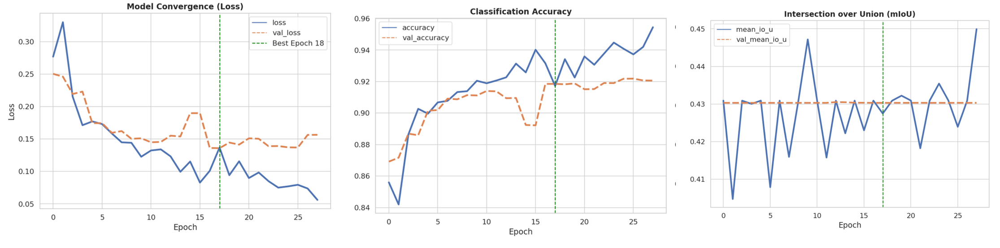
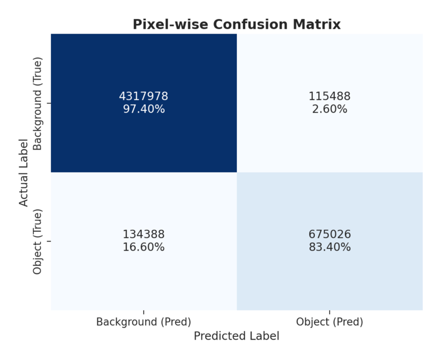
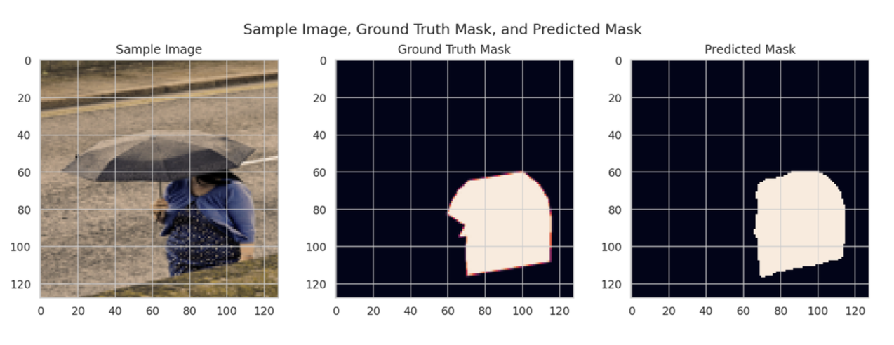
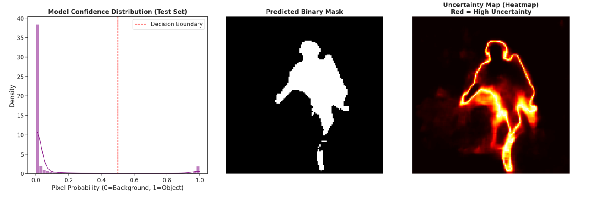

# U-Net Person Segmentation on MS COCO 2014

A complete deep-learning workflow for **binary person segmentation** using a U-Net-style encoder-decoder network implemented with TensorFlow/Keras. The project covers COCO annotation parsing, binary mask generation, custom data loading, model training, validation, test-time inference, and uncertainty visualization.

> **Scope note:** the notebook explicitly uses `classes = ['person']`, so this repository is documented as **person vs. background segmentation**. To segment all annotated COCO objects as foreground, the category filtering and mask-generation step would need to be changed.

## Project Pipeline

1. Load MS COCO 2014 train/validation images and instance annotations.
2. Filter images containing the `person` category.
3. Merge person-instance masks into one binary foreground mask per image.
4. Resize images and masks to `128 × 128` and normalize inputs.
5. Train a U-Net with encoder-decoder skip connections and batch normalization.
6. Optimize using Binary Cross-Entropy and Adam.
7. Evaluate pixel-level segmentation performance and inspect qualitative results.
8. Run inference on unseen images and visualize confidence/uncertainty maps.

## Model Configuration

| Component | Configuration |
|---|---|
| Task | Binary semantic segmentation |
| Foreground class | Person |
| Input size | 128 × 128 × 3 |
| Encoder filters | 64, 128, 256, 512 |
| Bottleneck filters | 1024 |
| Output | 1-channel sigmoid probability map |
| Loss | Binary Cross-Entropy |
| Optimizer | Adam |
| Initial learning rate | 1e-3 in the training notebook |
| Training batch size | 32 in the final training cell |
| Maximum epochs | 50 |
| Early stopping | Patience = 10 |
| LR scheduling | ReduceLROnPlateau, factor = 0.7, patience = 5 |
| Prediction threshold | 0.5 |

## Training Performance

<p align="center">
  
</p>

The training curves summarize model convergence, pixel accuracy, and the mIoU metric recorded during training.

## Reported Validation Summary

The project report summarizes the following validation results:

| Metric | Reported value |
|---|---:|
| Mean IoU (mIoU) | 0.43 |
| Precision | 0.78 |
| Recall | 0.61 |
| Dice coefficient | 0.69 |
| Pixel-wise accuracy | 0.92 |

> **Evaluation note:** the notebook also contains a separate threshold-based pixel evaluation routine that can produce different values from the training-time Keras metrics. For a final benchmark claim, rerun the final checkpoint and report one clearly defined evaluation protocol consistently.

### Pixel-wise Confusion Matrix

<p align="center">
  
</p>

## Qualitative Segmentation

<p align="center">
  
</p>

The model performs better on large, visually distinct foreground regions. Small objects, thin structures, low-contrast regions, and occlusion remain more difficult.

## Confidence and Uncertainty Analysis

<p align="center">
  
</p>

Pixel probabilities near the decision threshold indicate more ambiguous predictions, especially around object boundaries.

## Repository Structure

```text
unet-coco-person-segmentation/
├── README.md
├── UNet_COCO_Person_Segmentation.ipynb
├── requirements.txt
├── .gitignore
└── assets/
    ├── training_performance.png
    ├── confusion_matrix.png
    ├── qualitative_segmentation.png
    └── uncertainty_analysis.png
```

## Dataset

This project uses **MS COCO 2014** images and instance segmentation annotations. The dataset itself is intentionally **not included** in this repository.

Download the dataset from the official COCO website:

- https://cocodataset.org/#download

The notebook was developed using Kaggle-style paths, for example:

```text
/kaggle/input/coco2014/train2014/train2014
/kaggle/input/coco2014/val2014/val2014
/kaggle/input/coco2014/captions/annotations/instances_train2014.json
/kaggle/input/coco2014/captions/annotations/instances_val2014.json
```

If you run the notebook locally, update these paths to match your own dataset location.

## Installation

```bash
pip install -r requirements.txt
```

Main dependencies include TensorFlow/Keras, NumPy, Pillow, pycocotools, OpenCV, Matplotlib, Seaborn, Pandas, scikit-learn, and tqdm.

## How to Run

1. Download the COCO 2014 train/validation images and annotations.
2. Update dataset paths in the notebook if necessary.
3. Run the mask-generation cells to create binary person masks.
4. Build and train the U-Net model.
5. Evaluate predictions on the validation set.
6. Optionally provide an external test-image folder and run the inference/uncertainty sections.

The trained model, checkpoints, large datasets, generated masks, and inference archives are excluded from Git by default.

## Limitations

- The current implementation is binary and does not distinguish multiple semantic classes.
- Images are resized to 128 × 128, which can reduce fine boundary detail.
- Small, sparse, and heavily occluded foreground objects are more challenging.
- Binary Cross-Entropy alone does not explicitly optimize spatial overlap.
- Training-time and post-hoc segmentation metrics should be standardized before making benchmark comparisons.

## Possible Extensions

- Combine BCE with Dice or IoU-based loss.
- Train at higher image resolution.
- Add stronger data augmentation.
- Extend to multi-class semantic segmentation.
- Explore Attention U-Net or multi-scale feature aggregation.
- Standardize evaluation using thresholded masks and reproducible metric code.

## References

- Ronneberger, O., Fischer, P., & Brox, T. (2015). **U-Net: Convolutional Networks for Biomedical Image Segmentation.** https://arxiv.org/abs/1505.04597
- Lin, T.-Y. et al. (2014). **Microsoft COCO: Common Objects in Context.** https://arxiv.org/abs/1405.0312
